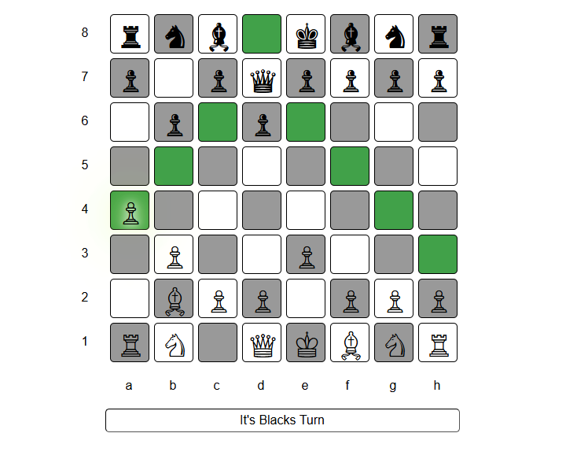

# ♟️ JavaScript Chess Game

A simple and interactive Chess game built using HTML, CSS, and JavaScript. Play against a friend in your browser!

## 🚀 Features

- Full 8x8 chessboard with standard pieces
- Legal move validation
- Turn-based play (White and Black)
- Game-over detection (checkmate, stalemate - optional)
- Intuitive drag-and-drop (or click-based) piece movement

## 🛠️ Tech Stack

- **HTML5** – Game layout and structure  
- **CSS3** – Styling the board and pieces  
- **JavaScript** – Game logic, piece movement, rules

## 📷 Screenshot

  

